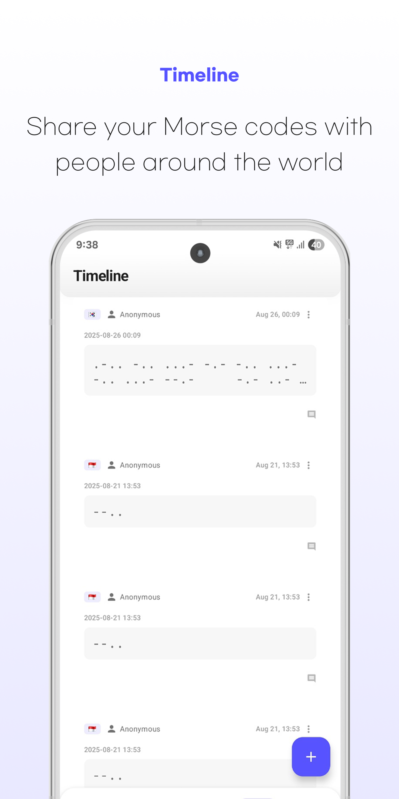

# most - Morse Code Translator
Unlock the classic language of dots and dashes with the ultimate Morse Code app!

Your all-in-one tool for Morse code translation, learning, and real-time communication. Whether you're a beginner starting your journey or an expert looking to connect, our app provides a seamless experience. Perfect for amateur radio (HAM) operators, secure messaging, or anyone learning a new skill.

## ✨ Highlights
- **Global Timeline Community** - Connect with Morse code enthusiasts worldwide, decode messages, and share your creations
- **Real-Time Morse Communicator** - Chat with other users on the same channel in real-time using Morse code
- **English & Korean Support** - Instantly translate and learn Morse code between English and Korean
- **Enhanced Audio Experience** - Crystal clear Morse code playback, generator, and audio file support

## 🚀 Key Features

### ■ Real-Time Morse Communicator
Go beyond translation and chat live! Connect with users on our dedicated Morse code channel. Send and receive messages in real-time, making it the perfect tool for live practice and communication with fellow enthusiasts.

### ■ Advanced Morse Code Translator & Decoder
Effortlessly handle two-way conversions between text and Morse code. Our powerful engine supports both English and Korean, providing instant, accurate translations. Use it as a Morse code generator to create messages or a decoder to read them.

### ■ Smart Storage System
Save important Morse code messages and bookmark your favorites for instant access and practice.

### ■ Global Community Timeline
Share your Morse code messages and creations on our public timeline. Connect with a worldwide community of learners and experts. Decode challenges, get feedback, and discover the creative potential of Morse code.

### ■ Enhanced Sharing
Share your Morse code messages across social media, messengers, and any platform with our improved sharing tools.

### ■ Premium Audio Experience
Listen to crystal-clear Morse code audio. Generate high-quality sound for any message and save it as an audio file. Our audio playback works in the background, perfect for learning on the go.

### ■ Smart Features
- Auto-language detection for easy translation
- Real-time bidirectional translation and decoding
- Simple copy and paste functionality
- Beautiful visual display of Morse code dots and dashes

## Screenshots

## Perfect For
- Aspiring Morse code learners
- Amateur radio (HAM) operators honing their skills
- Educators teaching communication
- Anyone looking to add a layer of fun and secrecy to their messages

## Installation

## Author
[Venchild](https://github.com/Venchild)

---
Download now and start your Morse code adventure!
